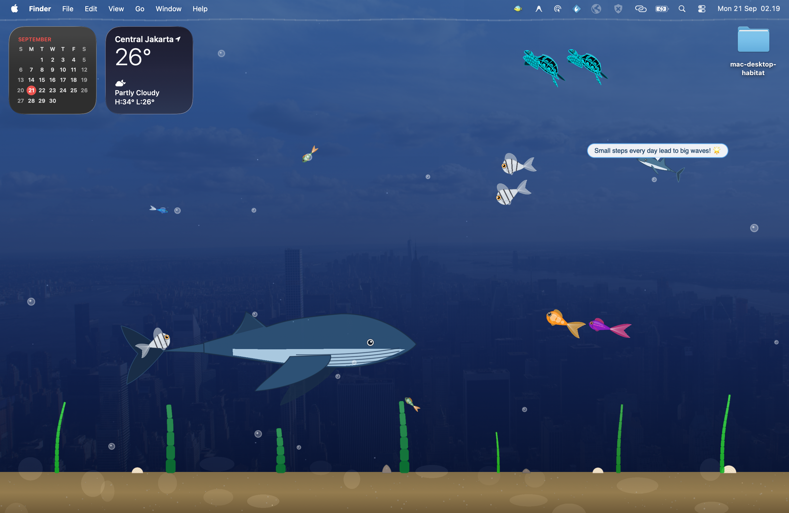

# Desktop Aquarium 🐠

A lightweight, interactive desktop aquarium app for macOS built with Swift and SpriteKit.

It floats as a transparent overlay on your screen with realistic swimming fish, sea turtles, an occasional visiting whale, and a dolphin that drops daily motivational quotes.



---

## Features

- **Realistic Fish Movement**: Fish swim with organic body bending, coast smoothly, and dart away if you move your mouse quickly near them.
- **Sea Turtles**: Detailed 3/4 perspective turtles that paddle around, graze near the plants, and swim up to the surface for air.
- **Visiting Whale**: A large whale periodically cruises across the background and blows mist from its blowhole.
- **Motivational Dolphin**: Swims twice as fast as the other fish and periodically pops up positive daily quotes. It automatically slows down while speaking so you can read comfortably.
- **Interactive Feeding**: Click anywhere in the tank or use the menu bar icon to drop sinking food pellets.
- **Ambient Tank Environment**: Translucent rising bubbles, swaying sea plants, and subtle caustic light reflections on the sand.
- **Menu Bar Control**: A handy 🐠 icon in your menu bar to feed fish, pause animations, or enable click-through mode so it acts as an ambient wallpaper while you work.

---

## Controls

- **Click on water**: Drop food pellets
- **Move cursor near fish**: Scares fish into a quick escape sprint
- **Menu Bar (🐠)**:
  - `Drop Food`: Feed the fish
  - `Pause / Resume`: Pause tank updates
  - `Click-Through`: Let mouse clicks pass through to your desktop/apps behind the aquarium
  - `Quit`: Exit the app

---

## How to Run
- You can just download the file desktop-habitat inside APP folder and just run it
  
### Requirements to adjust or develop
- macOS 14.0 or later
- Xcode 15+

### Steps
1. Clone the repo:
   ```bash
   git clone https://github.com/faiqadi/desktop-habitat.git
   cd desktop-habitat
   ```
2. Open `desktop-habitat.xcodeproj` in Xcode.
3. Select your Mac as the build target and press `Cmd + R` to run.

---

## License

MIT
